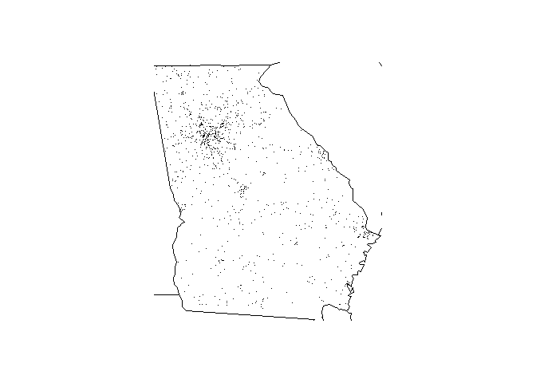

Vignetteinalassignemnt3
================
Thakur Dev Pandey
18 July 2017

Detail
------

This package provides a simple set of 5 functions, allowing to load, summarize and plot FARS data, with some filtering functions.

make\_filename
--------------

Produce standardized filnames for one or several years of data:

``` r
my_years<-c(2013, 2014, 2015)
my_filenames <- make_filename(my_years)
print(my_filenames)
```

    ## [1] "accident_2013.csv.bz2" "accident_2014.csv.bz2" "accident_2015.csv.bz2"

fars\_read
----------

Read one standardized FARS file and store it into a tib data.frame:

``` r
my_data_2013 <- fars_read(my_filenames[1])
str(my_data_2013)
```

    ## Classes 'tbl_df', 'tbl' and 'data.frame':    30202 obs. of  50 variables:
    ##  $ STATE     : int  1 1 1 1 1 1 1 1 1 1 ...
    ##  $ ST_CASE   : int  10001 10002 10003 10004 10005 10006 10007 10008 10009 10010 ...
    ##  $ VE_TOTAL  : int  1 2 1 1 2 2 1 2 1 2 ...
    ##  $ VE_FORMS  : int  1 2 1 1 2 2 1 2 1 2 ...
    ##  $ PVH_INVL  : int  0 0 0 0 0 0 0 0 0 0 ...
    ##  $ PEDS      : int  0 0 0 0 0 0 0 0 0 0 ...
    ##  $ PERNOTMVIT: int  0 0 0 0 0 0 0 0 0 0 ...
    ##  $ PERMVIT   : int  8 2 1 3 3 3 1 2 1 4 ...
    ##  $ PERSONS   : int  8 2 1 3 3 3 1 2 1 4 ...
    ##  $ COUNTY    : int  115 55 89 73 125 97 95 49 17 51 ...
    ##  $ CITY      : int  0 1670 1730 350 3050 2100 50 2904 0 0 ...
    ##  $ DAY       : int  6 3 6 6 6 8 11 14 5 5 ...
    ##  $ MONTH     : int  1 1 1 1 1 1 1 1 1 1 ...
    ##  $ YEAR      : int  2013 2013 2013 2013 2013 2013 2013 2013 2013 2013 ...
    ##  $ DAY_WEEK  : int  1 5 1 1 1 3 6 2 7 7 ...
    ##  $ HOUR      : int  0 21 11 12 18 14 21 14 16 17 ...
    ##  $ MINUTE    : int  55 24 45 25 28 31 30 49 21 34 ...
    ##  $ NHS       : int  1 1 0 0 1 1 0 0 0 0 ...
    ##  $ ROAD_FNC  : int  1 2 15 99 11 13 3 3 4 3 ...
    ##  $ ROUTE     : int  1 2 6 6 1 6 3 3 4 3 ...
    ##  $ TWAY_ID   : chr  "I-59" "US-SR 74" "OAKWOOD AVE" "JEFFERSON AVE SW" ...
    ##  $ TWAY_ID2  : chr  NA "MCCLAIN ST" NA NA ...
    ##  $ MILEPT    : int  1589 1397 0 0 10 0 95 910 0 1865 ...
    ##  $ LATITUDE  : num  33.8 34 34.7 33.5 33.2 ...
    ##  $ LONGITUD  : num  -86.4 -85.9 -86.6 -86.9 -87.6 ...
    ##  $ SP_JUR    : int  0 0 0 0 0 0 0 0 0 0 ...
    ##  $ HARM_EV   : int  42 12 30 24 12 12 34 12 42 12 ...
    ##  $ MAN_COLL  : int  0 6 0 0 1 6 0 2 0 6 ...
    ##  $ RELJCT1   : int  0 0 0 0 1 0 0 0 0 0 ...
    ##  $ RELJCT2   : int  1 2 1 1 18 2 1 1 1 2 ...
    ##  $ TYP_INT   : int  1 2 1 1 1 2 1 1 1 2 ...
    ##  $ WRK_ZONE  : int  0 0 0 0 0 0 0 0 0 0 ...
    ##  $ REL_ROAD  : int  4 1 4 4 1 1 4 1 4 1 ...
    ##  $ LGT_COND  : int  2 3 1 1 3 1 3 1 1 3 ...
    ##  $ WEATHER1  : int  10 10 10 1 1 1 2 2 10 10 ...
    ##  $ WEATHER2  : int  0 0 0 0 0 0 0 0 0 0 ...
    ##  $ WEATHER   : int  10 10 10 1 1 1 2 2 10 10 ...
    ##  $ SCH_BUS   : int  0 0 0 0 0 0 0 0 0 0 ...
    ##  $ RAIL      : chr  "0000000" "0000000" "0000000" "0000000" ...
    ##  $ NOT_HOUR  : int  99 99 99 99 99 99 99 99 88 99 ...
    ##  $ NOT_MIN   : int  99 99 99 99 99 99 99 99 88 99 ...
    ##  $ ARR_HOUR  : int  1 21 11 12 18 14 21 14 88 17 ...
    ##  $ ARR_MIN   : int  7 33 54 33 29 32 38 55 88 45 ...
    ##  $ HOSP_HR   : int  99 99 99 99 99 99 88 99 88 88 ...
    ##  $ HOSP_MN   : int  99 99 99 99 99 99 88 99 88 88 ...
    ##  $ CF1       : int  0 0 0 0 0 0 0 0 0 0 ...
    ##  $ CF2       : int  0 0 0 0 0 0 0 0 0 0 ...
    ##  $ CF3       : int  0 0 0 0 0 0 0 0 0 0 ...
    ##  $ FATALS    : int  2 1 1 2 1 1 1 1 1 1 ...
    ##  $ DRUNK_DR  : int  0 0 0 0 0 0 0 0 1 0 ...
    ##  - attr(*, "spec")=List of 2
    ##   ..$ cols   :List of 50
    ##   .. ..$ STATE     : list()
    ##   .. .. ..- attr(*, "class")= chr  "collector_integer" "collector"
    ##   .. ..$ ST_CASE   : list()
    ##   .. .. ..- attr(*, "class")= chr  "collector_integer" "collector"
    ##   .. ..$ VE_TOTAL  : list()
    ##   .. .. ..- attr(*, "class")= chr  "collector_integer" "collector"
    ##   .. ..$ VE_FORMS  : list()
    ##   .. .. ..- attr(*, "class")= chr  "collector_integer" "collector"
    ##   .. ..$ PVH_INVL  : list()
    ##   .. .. ..- attr(*, "class")= chr  "collector_integer" "collector"
    ##   .. ..$ PEDS      : list()
    ##   .. .. ..- attr(*, "class")= chr  "collector_integer" "collector"
    ##   .. ..$ PERNOTMVIT: list()
    ##   .. .. ..- attr(*, "class")= chr  "collector_integer" "collector"
    ##   .. ..$ PERMVIT   : list()
    ##   .. .. ..- attr(*, "class")= chr  "collector_integer" "collector"
    ##   .. ..$ PERSONS   : list()
    ##   .. .. ..- attr(*, "class")= chr  "collector_integer" "collector"
    ##   .. ..$ COUNTY    : list()
    ##   .. .. ..- attr(*, "class")= chr  "collector_integer" "collector"
    ##   .. ..$ CITY      : list()
    ##   .. .. ..- attr(*, "class")= chr  "collector_integer" "collector"
    ##   .. ..$ DAY       : list()
    ##   .. .. ..- attr(*, "class")= chr  "collector_integer" "collector"
    ##   .. ..$ MONTH     : list()
    ##   .. .. ..- attr(*, "class")= chr  "collector_integer" "collector"
    ##   .. ..$ YEAR      : list()
    ##   .. .. ..- attr(*, "class")= chr  "collector_integer" "collector"
    ##   .. ..$ DAY_WEEK  : list()
    ##   .. .. ..- attr(*, "class")= chr  "collector_integer" "collector"
    ##   .. ..$ HOUR      : list()
    ##   .. .. ..- attr(*, "class")= chr  "collector_integer" "collector"
    ##   .. ..$ MINUTE    : list()
    ##   .. .. ..- attr(*, "class")= chr  "collector_integer" "collector"
    ##   .. ..$ NHS       : list()
    ##   .. .. ..- attr(*, "class")= chr  "collector_integer" "collector"
    ##   .. ..$ ROAD_FNC  : list()
    ##   .. .. ..- attr(*, "class")= chr  "collector_integer" "collector"
    ##   .. ..$ ROUTE     : list()
    ##   .. .. ..- attr(*, "class")= chr  "collector_integer" "collector"
    ##   .. ..$ TWAY_ID   : list()
    ##   .. .. ..- attr(*, "class")= chr  "collector_character" "collector"
    ##   .. ..$ TWAY_ID2  : list()
    ##   .. .. ..- attr(*, "class")= chr  "collector_character" "collector"
    ##   .. ..$ MILEPT    : list()
    ##   .. .. ..- attr(*, "class")= chr  "collector_integer" "collector"
    ##   .. ..$ LATITUDE  : list()
    ##   .. .. ..- attr(*, "class")= chr  "collector_double" "collector"
    ##   .. ..$ LONGITUD  : list()
    ##   .. .. ..- attr(*, "class")= chr  "collector_double" "collector"
    ##   .. ..$ SP_JUR    : list()
    ##   .. .. ..- attr(*, "class")= chr  "collector_integer" "collector"
    ##   .. ..$ HARM_EV   : list()
    ##   .. .. ..- attr(*, "class")= chr  "collector_integer" "collector"
    ##   .. ..$ MAN_COLL  : list()
    ##   .. .. ..- attr(*, "class")= chr  "collector_integer" "collector"
    ##   .. ..$ RELJCT1   : list()
    ##   .. .. ..- attr(*, "class")= chr  "collector_integer" "collector"
    ##   .. ..$ RELJCT2   : list()
    ##   .. .. ..- attr(*, "class")= chr  "collector_integer" "collector"
    ##   .. ..$ TYP_INT   : list()
    ##   .. .. ..- attr(*, "class")= chr  "collector_integer" "collector"
    ##   .. ..$ WRK_ZONE  : list()
    ##   .. .. ..- attr(*, "class")= chr  "collector_integer" "collector"
    ##   .. ..$ REL_ROAD  : list()
    ##   .. .. ..- attr(*, "class")= chr  "collector_integer" "collector"
    ##   .. ..$ LGT_COND  : list()
    ##   .. .. ..- attr(*, "class")= chr  "collector_integer" "collector"
    ##   .. ..$ WEATHER1  : list()
    ##   .. .. ..- attr(*, "class")= chr  "collector_integer" "collector"
    ##   .. ..$ WEATHER2  : list()
    ##   .. .. ..- attr(*, "class")= chr  "collector_integer" "collector"
    ##   .. ..$ WEATHER   : list()
    ##   .. .. ..- attr(*, "class")= chr  "collector_integer" "collector"
    ##   .. ..$ SCH_BUS   : list()
    ##   .. .. ..- attr(*, "class")= chr  "collector_integer" "collector"
    ##   .. ..$ RAIL      : list()
    ##   .. .. ..- attr(*, "class")= chr  "collector_character" "collector"
    ##   .. ..$ NOT_HOUR  : list()
    ##   .. .. ..- attr(*, "class")= chr  "collector_integer" "collector"
    ##   .. ..$ NOT_MIN   : list()
    ##   .. .. ..- attr(*, "class")= chr  "collector_integer" "collector"
    ##   .. ..$ ARR_HOUR  : list()
    ##   .. .. ..- attr(*, "class")= chr  "collector_integer" "collector"
    ##   .. ..$ ARR_MIN   : list()
    ##   .. .. ..- attr(*, "class")= chr  "collector_integer" "collector"
    ##   .. ..$ HOSP_HR   : list()
    ##   .. .. ..- attr(*, "class")= chr  "collector_integer" "collector"
    ##   .. ..$ HOSP_MN   : list()
    ##   .. .. ..- attr(*, "class")= chr  "collector_integer" "collector"
    ##   .. ..$ CF1       : list()
    ##   .. .. ..- attr(*, "class")= chr  "collector_integer" "collector"
    ##   .. ..$ CF2       : list()
    ##   .. .. ..- attr(*, "class")= chr  "collector_integer" "collector"
    ##   .. ..$ CF3       : list()
    ##   .. .. ..- attr(*, "class")= chr  "collector_integer" "collector"
    ##   .. ..$ FATALS    : list()
    ##   .. .. ..- attr(*, "class")= chr  "collector_integer" "collector"
    ##   .. ..$ DRUNK_DR  : list()
    ##   .. .. ..- attr(*, "class")= chr  "collector_integer" "collector"
    ##   ..$ default: list()
    ##   .. ..- attr(*, "class")= chr  "collector_guess" "collector"
    ##   ..- attr(*, "class")= chr "col_spec"

fars\_read\_years
-----------------

Read several standardized FARS files in function of years specified in input, and store each file in one element of a list (only MONTH and year columns are preserved):

``` r
my_data_all <- fars_read_years(my_years)
str(my_data_all)
```

    ## List of 3
    ##  $ :Classes 'tbl_df', 'tbl' and 'data.frame':    30202 obs. of  2 variables:
    ##   ..$ MONTH: int [1:30202] 1 1 1 1 1 1 1 1 1 1 ...
    ##   ..$ year : num [1:30202] 2013 2013 2013 2013 2013 ...
    ##  $ :Classes 'tbl_df', 'tbl' and 'data.frame':    30056 obs. of  2 variables:
    ##   ..$ MONTH: int [1:30056] 1 1 1 1 1 1 1 1 1 1 ...
    ##   ..$ year : num [1:30056] 2014 2014 2014 2014 2014 ...
    ##  $ :Classes 'tbl_df', 'tbl' and 'data.frame':    32166 obs. of  2 variables:
    ##   ..$ MONTH: int [1:32166] 1 1 1 1 1 1 1 1 1 1 ...
    ##   ..$ year : num [1:32166] 2015 2015 2015 2015 2015 ...

fars\_summarize\_years
----------------------

Count the number of accidents for each month of every specified years:

``` r
my_summary <- fars_summarize_years(my_years)
my_summary
```

    ## # A tibble: 12 x 4
    ##    MONTH `2013` `2014` `2015`
    ##  * <int>  <int>  <int>  <int>
    ##  1     1   2230   2168   2368
    ##  2     2   1952   1893   1968
    ##  3     3   2356   2245   2385
    ##  4     4   2300   2308   2430
    ##  5     5   2532   2596   2847
    ##  6     6   2692   2583   2765
    ##  7     7   2660   2696   2998
    ##  8     8   2899   2800   3016
    ##  9     9   2741   2618   2865
    ## 10    10   2768   2831   3019
    ## 11    11   2615   2714   2724
    ## 12    12   2457   2604   2781

fars\_map\_state
----------------

Plot all accidents recorded a specified year in a state as black dots on a map:

``` r
fars_map_state(13, 2013)
```


